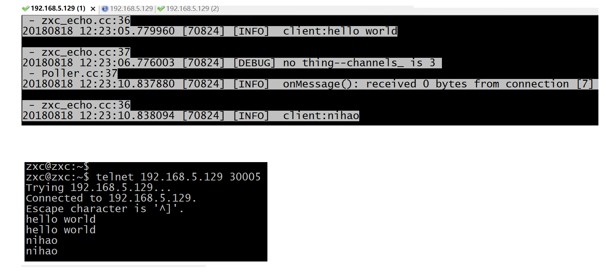

# zxc_net
A multi threads network library

## 简介
zxc_net是基于Reactor模式的多线程C++网络库

- 依赖于C++11提供的std::thread库,多线程表现在: 
    1. 为accept socket 的线程中的acceptFd 开启SO_RESUEPORT选项，多个线程拥有自己的Acceptor进行接收客户端连接.   
    2. 为每个拥有acceptFd的线程建立了线程池, 便于分发接收到的clientFd.   解决了TCP连接负载均衡的问题, 减少客户连接等待时间. 

- 非阻塞的poll模式,
- 拥有read/write buff缓冲区, readv + LT 触发可以读取较大数据.


## 例子

一个简单的echo服务器：
main函数如下：

```c++
int main() {
	
	//  setLogLevel(LOG_LEVEL_INFO);
	
	
	INFO("I'm enter\n");
	
	using namespace zxc_net;

	EventLoop loopF;
	EventLoop* loop = &loopF;

	std::string ip = "192.168.5.129";
	uint16_t port = 30005;
	InetAddress local(ip,port);

	TcpServerMulti  serverAll(loop, local);

	serverAll.setConnectionCallback(onConnection);
	serverAll.setMessageCallback(messageFunction);

	serverAll.setNumThread(1);
	serverAll.start();

	loopF.runAfter(Second(2), runInThread);
	loopF.loop();

}
```


这个实现非常简单，可以看到`messageFunction`回调函数，它将收到消息重新发给客户端。

```c++
void messageFunction(const std::shared_ptr<zxc_net::TcpConnection> & conn, zxc_net::Buffer& buf) {

	int p = buf.readableBytes();
	std::string ps = buf.retrieveAllAsString();
	INFO("onMessage(): received %zd bytes from connection [%zd] at %s\n",
		buf.readableBytes(),
		p,
		ps.c_str());
    INFO("client:%s\n",ps.c_str());
	conn->send(ps);

}

void runInThread()
{
	INFO("\nrunInThread(): pid = %d, tid \n", getpid());
}
```




## 安装

```sh
$ ./build.sh 
$ ./build.sh install

```
安装在 `../zxc_net-build/Release/{include, lib, bin}`